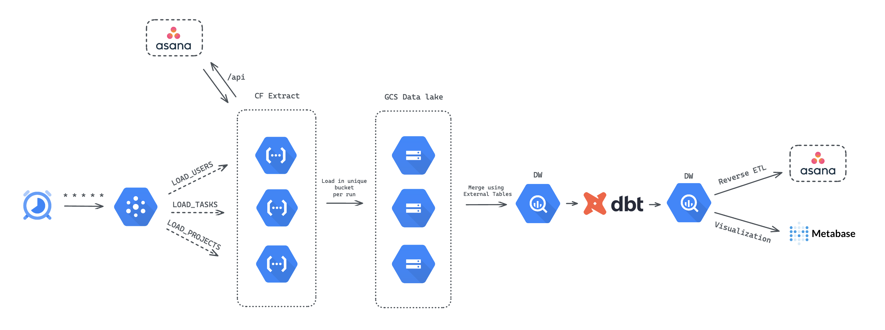

# Asana task management ELT Pipeline 🧘‍♀️
An end to end data engineering project using Asana API data as an example to create a complete data pipeline in Google Cloud. In addition, both the loader and the dbt project can be configured to work locally in a PostgreSQL instance.

## Technology Stack
- Loader functionalities written in Node.js.
- Google Cloud Platform orchestration.
    - Cloud Scheduler
    - Cloud Pub/Sub
    - Cloud Functions
    - Cloud Storage
    - BigQuery
- Data modeling using dbt.
- Analyses queries for visualization (_showcased in Metabase_).
- Reverse ETL example.

## Pipeline Architecture

## Setup steps
_TBD..._
